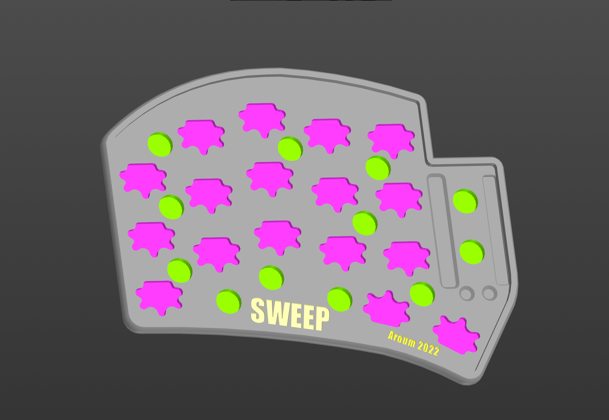
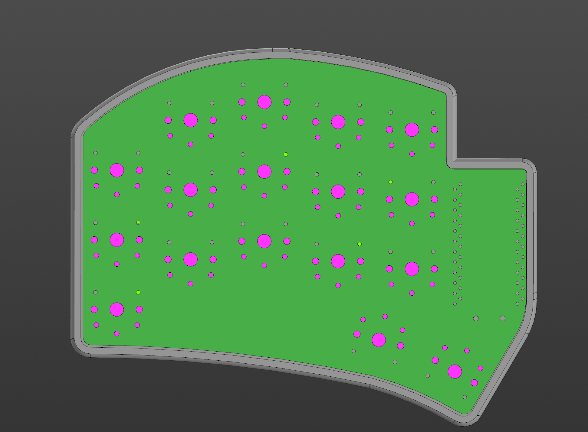
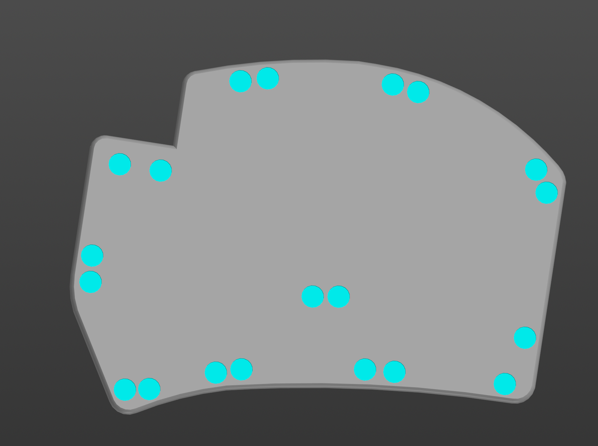
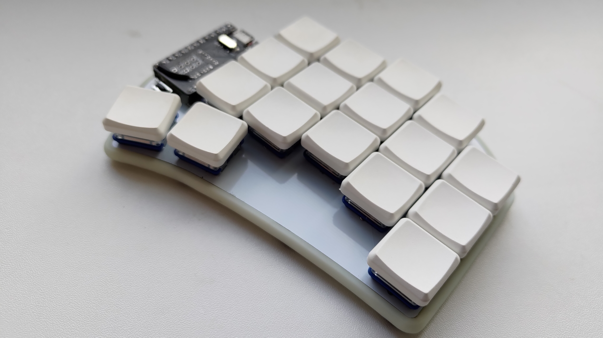
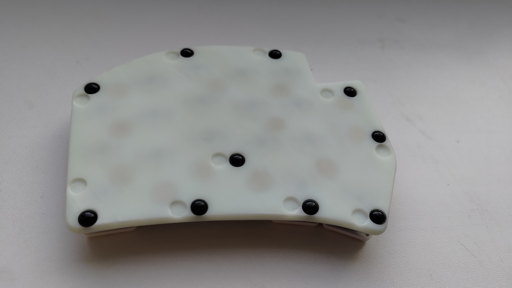
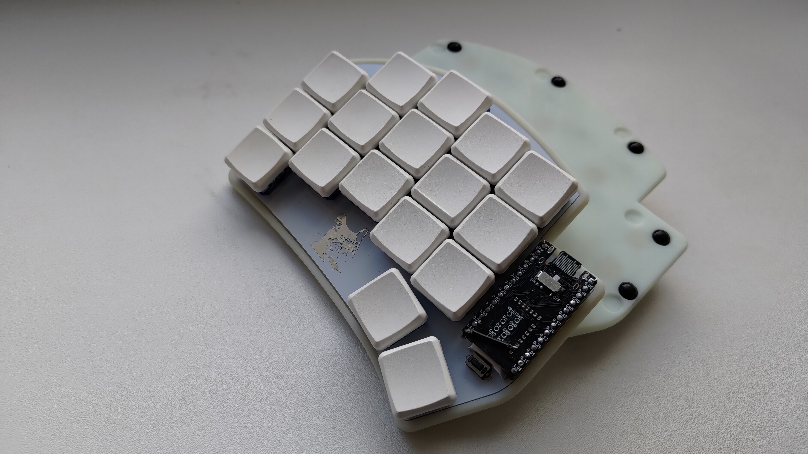
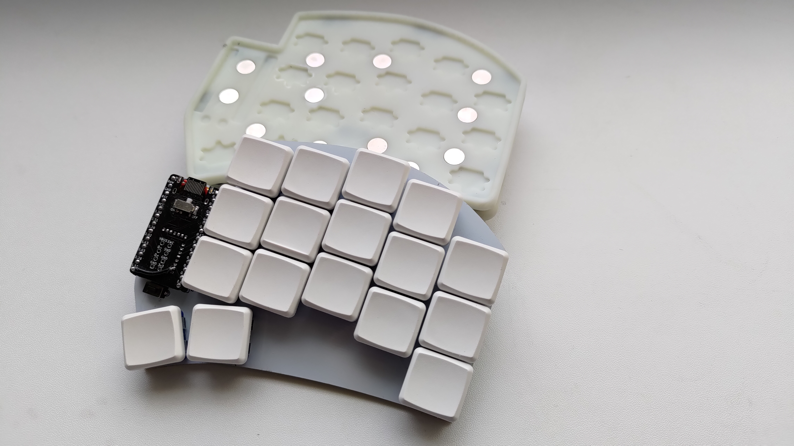
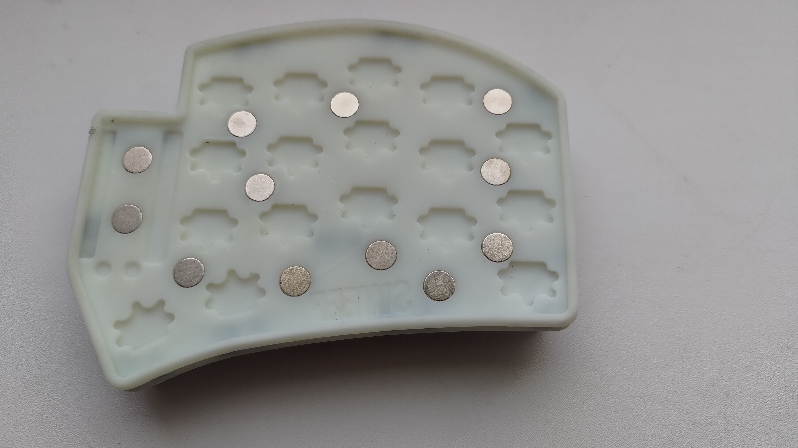

# sweep-compact-ble-case
3D model of the case for [sweep compact ble keyboard](https://github.com/davidphilipbarr/Sweep).

PCB factory tolerances and 3D printer tolerances can be very different. Choose the optimal size by changing the scale and then the PCB will keep on friction or make the scale a little larger and use double-sided tape.

Thanks to the use of magnets, the keyboard can be stored on metal surfaces or the two halves can be folded together for storage.

STL-file can be downloaded in [releases](https://github.com/aroum/sweep-compact-ble-case/releases).

# BOM

| Item                                                          | Quantity | Remarks                   |
| ------------------------------------------------------------- | -------: | ------------------------- |
| [Magnets](https://aliexpress.ru/item/1005002757445161.html)   | 2-6      | disc 7x2 mm (for case)    |
| [Bumpers](https://aliexpress.ru/item/4001188580018.html)      | 7        | 5x2 mm                    |

